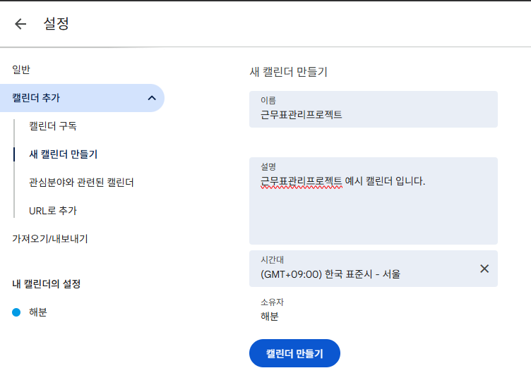
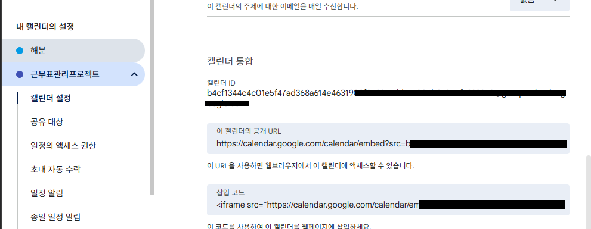
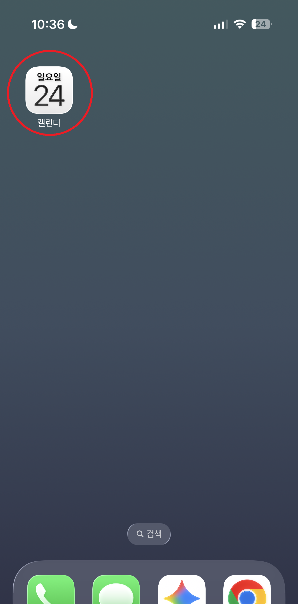
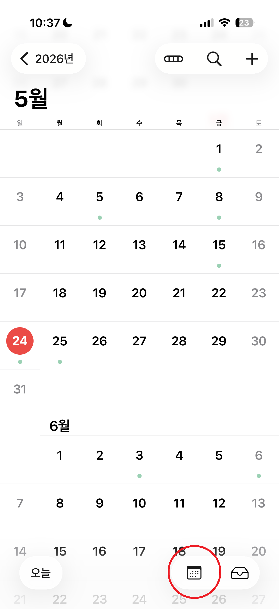
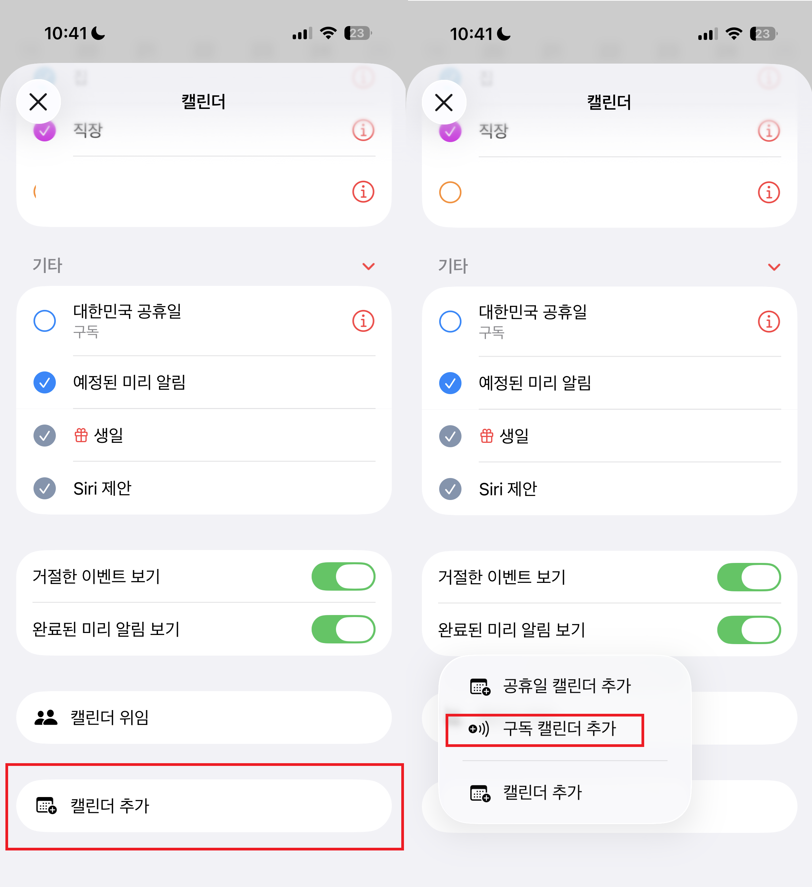
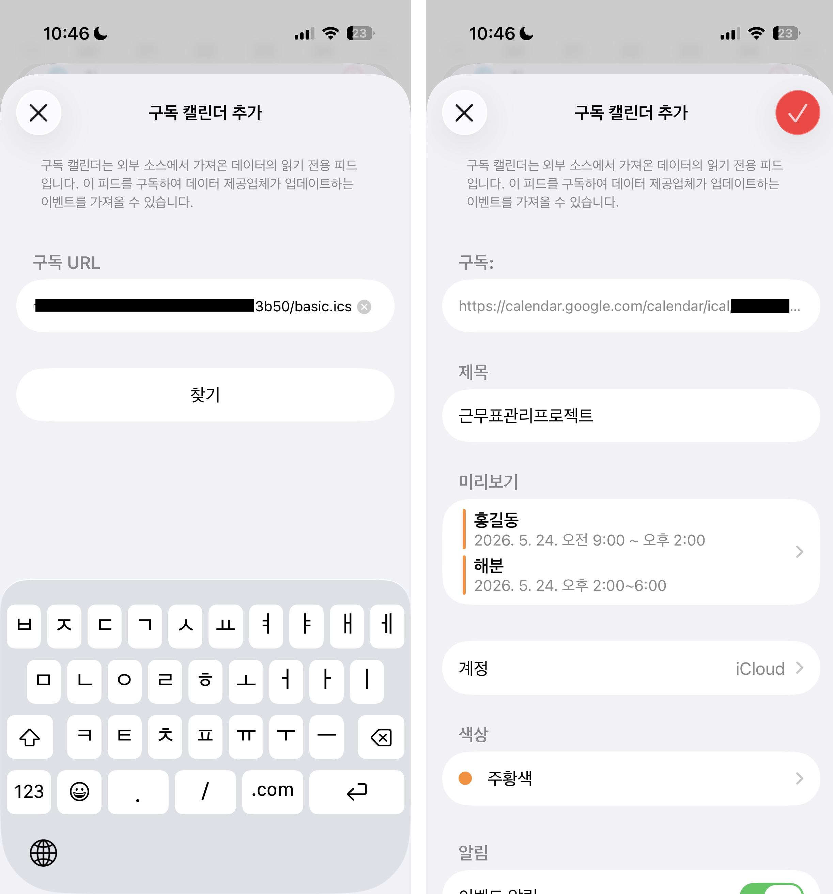
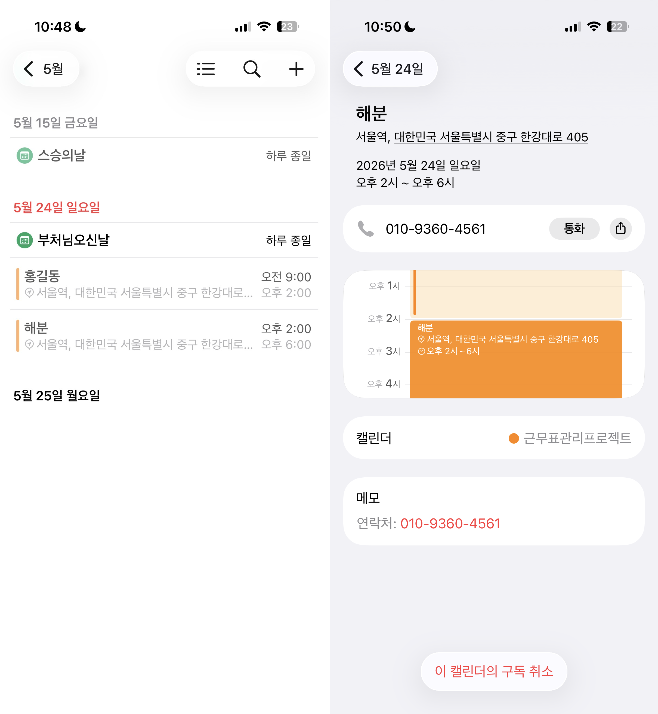
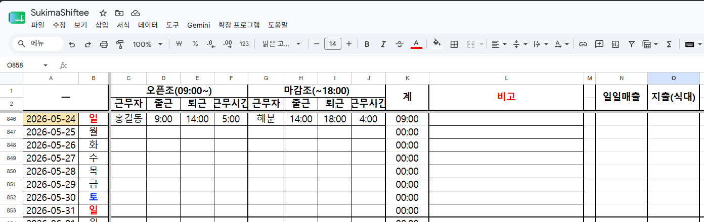

# SukimaShiftee

근무표 관리와 급여 계산을 위해 구글 캘린더, Google Apps Script, Google Spreadsheet를 연동하는 프로젝트입니다.

| Language | Name             |
| -------- | ---------------- |
| 日本語   | スキマシフティー |
| 한국어   | 스키마시프티     |
| English  | SukimaShiftee    |


## 1. 직원 및 아르바이트 근무표 관리

- 근무자별 근무표를 구글 캘린더로 관리한다.
- 구글 캘린더와 스프레드시트를 연동해, 근로자와 매니저가 근무표를 실시간으로 확인할 수 있도록 한다.
- 시프트, 대타, 시간 변동을 조정하고, 매니저가 근무자의 부재나 변경 사항을 수정하여 직원 모두가 인지할 수 있도록 한다.
- 스프레드시트에서 근무 내역을 정리해 월말 급여 계산을 편하게 한다.
- 사장님께 최종 확인과 월말 보고를 빠르게 제공할 수 있도록 자료를 정리한다.

## 2. 클라이언트 사용 방법

### 2-1. 근로자

1. 스마트폰 캘린더 앱을 통해 캘린더를 연동하고 근무 일정을 확인한다.

### 2-2. 매니저

1. 구글 캘린더에 근무 일정을 추가한다.
2. 일정 제목에 근무자명을 입력한다.
3. 근무시간을 함께 기입한다.
4. 메모에는 기타 필요한 정보를 적는다.
5. 스프레드시트에서 해당 날짜의 근무 스케줄을 확인한다.
6. 셀 수식 등을 적용해 스프레드시트에서 관리한다.

### 2-3. 사장

1. 연결된 캘린더 링크를 통해 실시간 근무자를 확인할 수 있다.
2. 최종 보고는 매니저에게 전달받는다.
3. 월말 시간 당 급여 계산 결과와 최종 보고서를 확인받는다.

### 2-4. 전체 진행 순서

1. 근로자가 캘린더 앱에서 근무 일정을 확인한다.
2. 매니저가 근무표와 변경 사항을 정리한다.
3. 사장이 캘린더 링크를 통해 실시간 근로자를 확인할 수 있다.

## 3. 오너 요구사항

이 프로젝트는 오너가 매장 내 근무 스케줄을 실시간으로 확인하고, 최종 보고 형태로 받을 수 있도록 목표로 합니다.

- 근무자가 누구인지 바로 확인할 수 있어야 한다.
- 근무시간과 메모 등을 함께 확인할 수 있어야 한다.
- 급여 계산 결과를 한눈에 정리할 수 있어야 한다.
- 수정이 필요한 경우 빠르게 다시 확인할 수 있어야 한다.
- 최종 보고서처럼 정리되어 사장님에게 전달하기 쉬워야 한다.

## 4. 사용자 구조

이 프로젝트의 사용자는 다음과 같이 구분합니다.

- 근로자: iOS 또는 Android 기반의 기본 캘린더 앱에서 자신의 근무 일정과 변경 사항을 확인한다.
- 매니저: 근무표, 시프트 변경, 대타 여부를 확인하고 조정한다.
- 사장: 연결된 캘린더 링크와 최종 보고를 통해 월말 급여 계산 결과를 확인한다.


## 5. Google Calendar

구글 캘린더는 근무 일정이 시작되는 기준점입니다. 앞으로 이 섹션에는 일정 추가 방식, 제목과 메모 규칙, 확인 방법을 하나씩 정리합니다.

### 5-1. 현재 역할

- 근무 일정 입력의 기준이 된다.
- 근무자와 매니저가 실시간 일정 확인에 사용하는 출발점이다.
- 사장은 연결된 캘린더 링크를 통해 근무 현황을 확인한다.

### 5-2. 설정 방법

1. 새 캘린더를 생성합니다.


2. 생성된 캘린더의 ID를 복사해 둡니다.


3. 근무자들에게 해당 캘린더를 확인할 수 있도록 공유합니다.

### 5-3. 근로자 사용 메뉴얼


### iOS
1. 캘린더 앱을 실행합니다.
    
2. 화면 하단의 캘린더 버튼을 누른 뒤 아래로 스크롤합니다.
    
3. 캘린더 추가를 누르고, 구독 캘린더 추가를 선택합니다.
    
5. 구독 URL 입력란에 iCal 형태의 공개 주소를 입력한 뒤 찾기를 누릅니다.
    
6. 등록된 캘린더를 추가하고 근무표를 확인합니다.
    

### Android
준비중

### 5-4. 사용자 관점

- 근로자: 캘린더 앱에서 자신의 근무 일정과 변경 사항을 확인한다.
- 매니저: 구글 캘린더에 근무 일정을 추가하고 변경 사항을 반영한다.
- 사장: 연결된 캘린더 링크를 통해 실시간 근무자를 확인한다.

## 6. Google Apps Script

Google Apps Script는 캘린더와 스프레드시트를 연결하고, 시간 단위 트리거로 자동 조회를 수행합니다. 앞으로 이 섹션에는 트리거 설정, 실행 함수, 자동화 흐름을 하나씩 정리합니다.

### 6-1. 현재 역할

- 오픈조와 마감조를 구분해 근무표를 정리한다.
- 시간 단위 트리거로 근무 일정을 주기적으로 조회한다.
- 캘린더 데이터를 읽어 스프레드시트에 반영한다.

### 6-2. 설정 과정

- 시간 단위 트리거 설정 정리 예정
- 실행 함수 연결 방식 정리 예정
- 자동 조회 범위와 기준일 정리 예정

### 6-3. 함수 역할

- 시간 단위 트리거로 자동 실행되어 근무 일정을 주기적으로 조회한다.
- 캘린더 ID로 해당 캘린더를 찾는다.
- 기준일을 기준으로 업데이트할 시작 행을 계산한다.
- 기존 데이터는 필요한 구간만 지우고, 과거 기록은 보존한다.
- 한 달 전부터 2026년 12월 31일까지의 일정을 읽어 온다.
- 시작 시간이 오전 11시 이전이면 오픈조, 이후면 마감조로 구분한다.
- 근무자명, 시작 시간, 종료 시간, 근무 시간을 스프레드시트에 기록한다.

### 6-4. 코드

이 함수는 시간 단위 트리거에 연결되어 자동으로 실행되도록 설정해 둡니다.

```javascript
function getCafeShiftSchedule() {
  var ss = SpreadsheetApp.getActiveSpreadsheet();
  
  // --- 1. 시트 이름을 '메인'으로 설정 ---
  var sheetName = "메인"; 
  var sheet = ss.getSheetByName(sheetName);
  
  if (!sheet) {
    SpreadsheetApp.getUi().alert("'" + sheetName + "' 시트를 찾을 수 없습니다. 시트 이름을 확인해주세요.");
    return;
  }

  var calendarId = '캘린더 ID 입력';
  var calendar = CalendarApp.getCalendarById(calendarId);
  
  if (!calendar) {
    Logger.log("캘린더를 찾을 수 없습니다.");
    return;
  }

  // --- 2. 날짜 설정 (한 달 전부터 시작) ---
  var now = new Date();
  var startDate = new Date();
  startDate.setDate(now.getDate() - 30); // 오늘 기준 30일 전
  startDate.setHours(0, 0, 0, 0);
  
  var endDate = new Date(2026, 11, 31); // 종료일: 2026년 12월 31일
  
  // 관리표의 절대적 시작 기준일(영업 개시일) (2024-02-01)
  var baseDate = new Date(2024, 1, 1);
  
  // 기준점으로부터 업데이트 시작일(한 달 전)까지의 일수 계산
  var diffTime = startDate.getTime() - baseDate.getTime();
  var diffDays = Math.floor(diffTime / (1000 * 60 * 60 * 24));
  
  // 3행이 2024-02-01이므로 시작 행은 3 + diffDays
  var startRow = 3 + diffDays;

  // --- 3. 데이터 업데이트 구간 초기화 ---
  // 시작 행부터 마지막 행까지만 지워서 과거 기록을 보존
  var lastRow = sheet.getLastRow();
  if (lastRow >= startRow) {
    sheet.getRange(startRow, 1, lastRow - startRow + 1, 10).clearContent();
  }

  var rowData = [];
  var currentDate = new Date(startDate);

  // --- 4. 캘린더 데이터 가져오기 ---
  while (currentDate <= endDate) {
    var dayStart = new Date(currentDate.getTime());
    dayStart.setHours(0, 0, 0, 0);
    var dayEnd = new Date(currentDate.getTime());
    dayEnd.setHours(23, 59, 59, 999);
    
    var events = calendar.getEvents(dayStart, dayEnd);
    
    var row = [
      Utilities.formatDate(dayStart, "GMT+9", "yyyy-MM-dd"),
      getDayOfWeek(dayStart),
      "", "", "", "", // 오픈조 (이름, 시작, 종료, 시간)
      "", "", "", ""  // 마감조 (이름, 시작, 종료, 시간)
    ];

    events.forEach(function(event) {
      var startTime = event.getStartTime();
      var endTime = event.getEndTime();
      var diffMs = endTime - startTime;
      var diffHrs = Math.floor(diffMs / (1000 * 60 * 60));
      var diffMins = Math.round((diffMs % (1000 * 60 * 60)) / (1000 * 60));
      
      // 24시간 이상인 경우 0:00 처리 (휴무 등 예외 상황)
      var hoursStr = diffHrs >= 24 ? "0:00" : diffHrs + ":" + (diffMins < 10 ? "0" + diffMins : diffMins);

      var startStr = Utilities.formatDate(startTime, "GMT+9", "HH:mm");
      var endStr = Utilities.formatDate(endTime, "GMT+9", "HH:mm");
      var worker = event.getTitle();

      // 오전 11시 이전 시작은 오픈조, 이후는 마감조로 분류
      if (startTime.getHours() < 11) {
        row[2] = worker; row[3] = startStr; row[4] = endStr; row[5] = hoursStr;
      } else {
        row[6] = worker; row[7] = startStr; row[8] = endStr; row[9] = hoursStr;
      }
    });

    rowData.push(row);
    currentDate.setDate(currentDate.getDate() + 1);
  }

  // --- 5. 계산된 위치에 데이터 일괄 기록 ---
  if (rowData.length > 0) {
    sheet.getRange(startRow, 1, rowData.length, 10).setValues(rowData);
    Logger.log("'"+ sheetName + "' 시트에 " + Utilities.formatDate(startDate, "GMT+9", "yyyy-MM-dd") + " 부터 업데이트 완료");
  }
}

// 요일 구하기 함수
function getDayOfWeek(date) {
  var week = ['일', '월', '화', '수', '목', '금', '토'];
  return week[date.getDay()];
}
```
## 7. Google Spreadsheet

Google Spreadsheet는 캘린더에서 읽어 온 근무 일정을 정리하고, 월말 급여 계산과 최종 보고 자료를 확인하는 공간입니다. 앞으로 이 섹션에는 시트 구조, 열 구성, 계산 규칙을 하나씩 정리합니다.

### 7-1. 현재 역할

- 근무표를 한눈에 확인한다.
- 근무 내역을 기반으로 급여 계산을 정리한다.
- 최종 보고용 자료를 저장하고 검토한다.

### 7-2. 설정 과정

- 시트 구조 정리 예정
- 열 구성 정리 예정
- 급여 계산 결과 정리 예정



### 7-3. 사용자 관점

- 근로자: 자신의 근무 일정이 시트에 반영되었는지 확인한다.
- 매니저: 스프레드시트에서 근무 스케줄과 변경 사항을 정리한다.
- 사장: 월말 급여 계산 결과와 최종 보고서를 확인한다.

## 8. 정리 방식

이 README는 Google Calendar, Google Apps Script, Google Spreadsheet 순서로 내용을 하나씩 추가하는 방식으로 정리합니다.

앞으로 들어갈 내용 예시:

- Google Calendar 설정 과정
- Google Apps Script 설정 과정
- Google Spreadsheet 설정 과정
- 근무표 입력 방법
- 급여 계산 규칙
- 예외 처리 방식
- 실제 화면 캡처
